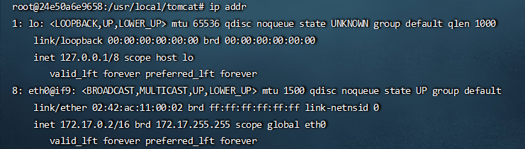
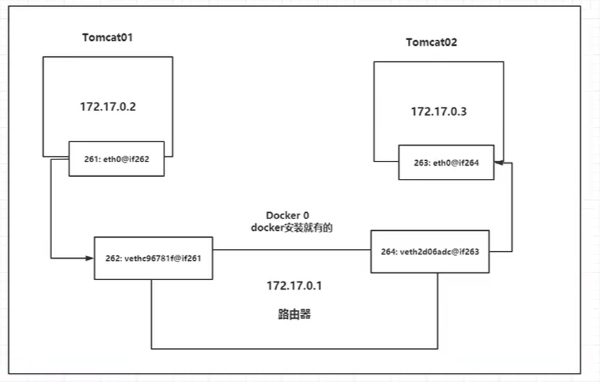
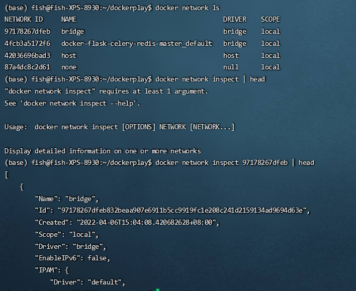
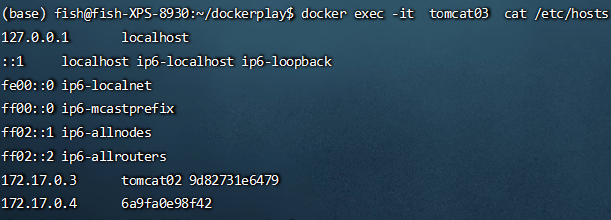
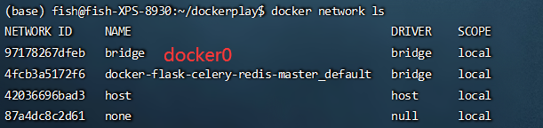
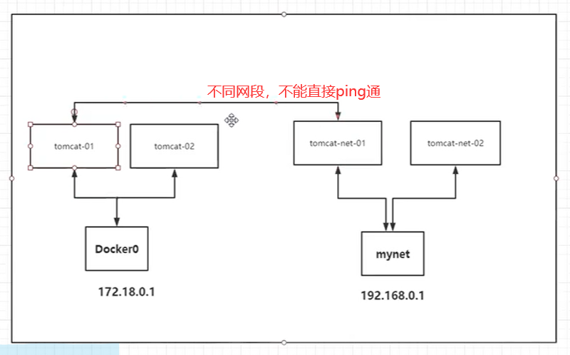

# Docker0

## 准备工作
可以先删除所有容器和镜像简化环境
```bash
docker rm -f $(docker ps -aq)
docker rmi -f $(docker images -aq)
```

## 查看本机网卡：
```bash
$ ip addr
    1. : lo: ......
    2. : ......
    3. : wlp3s0:
        inet 172.25.63.236/16 brd 172.25.255.255 ......
    4. : docker0:     
        inet <b>172.17.0.1/16</b> brd 172.17.255.255 ... docker0
    5. : br-4fcb3a5172f6: ...
```

+ lo：本机回环地址
+ enp4s0：有线网卡
+ wlp3s0：无线网卡
+ docker0：Docker地址

# 开启一个tomcat测试网络互联：
```bash
docker run -d -P --name tomcat01 tomcat # 下载tomcat镜像
# 下条命令执行失败需要进入容器执行apt update && apt install -y iproute2
docker exec -it tomcat01 ip addr # 查看容器网卡
```



Linux可以直接ping通docker容器内部：

宿主机ipaddr: 172.17.0.1（相当于路由器地址）

tomcat容器ipaddr：172.17.0.2/16

两者在同一个网段内，可以ping通

每启动一个docker容器，就会被分配一个ip

只要安装了docker，就会有一个docker0网卡

桥接模式，使用的是evtn-pair技术
```bash
    veth8aa380e@if8: <BROADCAST,MULTICAST,UP,LOWER_UP> mtu 1500 qdisc noqueue master docker0 state UP group default 
        link/ether 86:21:09:5b:a9:ca brd ff:ff:ff:ff:ff:ff link-netnsid 0
        inet6 fe80::8421:9ff:fe5b:a9ca/64 scope link 
        valid_lft forever preferred_lft forever
```
发现容器带来的网卡，都是一对一对的，
evth-pair是一对虚拟设备接口。他们都是成对出现的，一端连接协议，
一段彼此相连。evth-pair充当桥梁连接各种虚拟网络设备

### 启动tomcat02
```bash
docker run -d -P --name tomcat02 tomcat
```

测试tomcat01和tomcat02相互可以ping通
```bash
docker exec -it tomcat02 ping 172.18.02
```


tomcat01和tomcat02是公用的一个路由器docker0

所有的容器在不指定网络的情况下，都是docker0路由

docker会给我们分配一个默认可用的ip

## --link（不建议）
```bash
docker ps
docker exec -it tomcat02 ping tomcat01 # service or name not known
docker run -d -P --name tomcat03 --link tomcat02   tomcat
```

通过--link后，不用使用ip，使用容器名字就可以访问
但是反向不可以ping通

```bash
# 介绍docker network
docker network COMMAND

Manage networks

Commands:
  connect     Connect a container to a network
  create      Create a network
  disconnect  Disconnect a container from a network
  inspect     Display detailed information on one or more networks
  ls          List networks
  prune       Remove all unused networks
  rm          Remove one or more networks

```

如果去查看tomcat03的hosts文件，会发现添加到了hosts文件信息。
所以由于反向tomcat02没有配置tomcat02，ping不通



不方便，不支持按容器名访问，因此需要自定义网络

# 自定义网络
通过--link能够容器互联，通过自定义网络也可以容器互联
```bash
docker network COMMAND

Manage networks

Commands:
  connect     Connect a container to a network
  create      Create a network
  disconnect  Disconnect a container from a network
  inspect     Display detailed information on one or more networks
  ls          List networks
  prune       Remove all unused networks
  rm          Remove one or more networks

```
查看所有的docker网络
```bash
# 清理环境
docker rmi -f $(docker images -aq)
docker rm -f $(docker ps -aq)
docker network ls

# 创建一个网络
docker network create --driver bridge --subnet 192.168.0.0/16 --gateway 192.168.0.1  mynet
# --driver bridge :默认桥接，不写也行
# --subnet 192.168.0.0/16：子网。/16代表可以创建65535个网络 /24就只能创建255个
# 即192.168.0.2 ~ 192.168.255.255
# --gateway 网关，从哪里出去，一般都是0下面一个01
# mynet网络名字
# 534211fa69fc2cca9e57f5ced48f416a227fa087bd14861a41f79c5e600648c1
# 查看网络信息
docker network inspect mynet
```


这样接下来自己的服务就可以放在此网络里面
```bash
docker run -d -P --name tomcat-net-01 --net mynet tomcat
docker run -d -P --name tomcat-net-02 --net mynet tomcat

# 下面两条都是可以ping通的，这也是自定义网络的好处
docker exec -it tomcat-net-01 ping 192.168.0.3
docker exec -it tomcat-net-01 ping tomcat-net-02
```
# 网络联通
以下场景：肯定不通


此时就需要docker0与mynet打通，而且不能是网卡打通（docker0-mynet），而应该是容器能够连接到mynet
```bash
# docker network connect [OPTIONS] NETWORK CONTAINER
docker network connect mynet tomcat01
# 联通之后就是将tomcat01放到了mynet下，一个容器，两个ip地址
```
# docker网络模式补充

+ bridge：桥接模式（默认）
+ none：不配置网络
+ host：和宿主机共享网络
+ container：容器内网络联通（局限多，用的少）

桥接模式(bridged): 

    在bridged模式下, VMWare虚拟出来的操作系统就像是局域网中的一台独立的主机, 它可以访问网内任何一台机器. 主机网卡和虚拟网卡的IP地址处于同一个网段, 子网掩码, 网关, DNS等参数都相同. 

    这种方式简单, 直接将虚拟网卡桥接到一个物理网卡上面, 和linux下一个网卡 绑定两个不同地址类似, 实际上是将网卡设置为混杂模式, 从而达到侦听多个IP的能力. 在此种模式下, 虚拟机内部的网卡(例如linux下的eth0)直接连到了物理网卡所在的网络上, 可以想象为虚拟机和host机处于对等的地位, 在网络关系上是平等的, 没有谁在谁后面的问题. 

NAT模式: 

    使用NAT模式可以实现在虚拟系统里访问互联网. 就是让虚拟系统借助NAT(网络地址转换)功能, 通过宿主机器所在的网络来访问公网. 

启动docker容器后，在宿主机再次执行ip addr会发现veth8aa380e@if8，含义是veth8网卡绑定了if8网卡，跟容器内的一致
