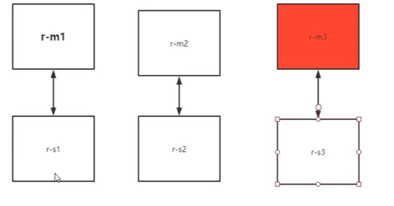

<!--
 * @Author: your name
 * @Date: 2022-03-31 15:36:12
 * @LastEditTime: 2022-03-31 21:01:27
 * @LastEditors: Please set LastEditors
 * @Description: 打开koroFileHeader查看配置 进行设置: https://github.com/OBKoro1/koro1FileHeader/wiki/%E9%85%8D%E7%BD%AE
 * @FilePath: \docker学习\作业练习.md
-->
# nginx
```shell
docker search nginx
docker pull nginx
docker run -d --name nginx01 -p 3344:80 nginx
docker ps

curl 127.0.0.1:3344 # 查看请求
docker exec -it nginx01 /bin/bash
whereis nginx # 查看程序地址和配置文件

# nginx: /usr/sbin/nginx /usr/lib/nginx /etc/nginx /usr/share/nginx
```
# tomcat
```bash
docker run -it --rm tomcat:9.0 
# 之前的启动都是后台，启动了之后，容器还是可以查到。
# --rm一般用来测试，用完即删
docker pull tomcat
docker run -d -p 3355:8080 --name tomcat01 tomcat

# 但是官方的镜像精简版没有webapps（报404）
```
# es+kibana
es 暴露的端口很多、耗内存、数据需要放置到安全目录
```bash
docker run -d --name elasticsearch --net somenetwork -p 9200:9200 -p \ 9300:9300 -e "discovery.type=single-node" elasticsearch:7.6.2

docker stats 查看资源占用情况
# 添加 '-e ES_JAVA_OPTS="-Xms128m -Xmx512m" '
# 配置ElasticSearch的虚拟机占用的内存大小。
```

# Portaniner
Docker的图形化管理工具，类似的工具还有Rancher(CI/CD再用)
```bash
docker run -d -p 8088:9000 --restart=always -v /var/run/docker.sock:/var/run/docker.sock --privileged=true portainer/portainer
```
# MySQL
```bash
docker run -d -p3310:3306 -v /home/mysql/conf:/etc/mysql/conf.d -v /home/mysql/data:/var/lib/mysql -e MYSQL_ROOT_PASSWORD=123456 --name mysql01 mysql:5.7
```
如果删除容器，数据仍然在
# 构建自己的CentOS
```Dockerfile
FROM centos
MAINTAINER bx<1373953675@qq.com>
ENV MYPATH /usr/local
WORKDIR $MYPATH # 进入容器默认到此目录

RUN yum -y install vim
RUN yum -y install net-tools

EXPOSE 80
CMD echo $MYPATH
CMD echo "------end-----"
CMD /bin/bash
```

```bash
docker build -f Dockerfile -t mycentos:0.1 . # 点不能缺少
docker history imagesId # 查看镜像构建历史
```

# 一步步编写Tomcat Dockerfile
需要：tomcat的压缩包，jdk的压缩包：
[tomcat](http://archive.apache.org/dist/tomcat/tomcat-9/v9.0.22/bin/apache-tomcat-9.0.22.tar.gz) and [jdk](https://pan.baidu.com/s/19Eg67jW6V5XkDAfYQ0lxhA?code=6r5f)
```bash
touch readme.txt
vim Dockerfile:
    FROM centos
    MAINTAINER BX<1373953675@qq.com>

    COPY readme.txt /usr/local/readme.txt
    
    ADD jdk-...- /usr/local/
    ADD apache-tomcat-... /usr/local/
    # RUN yum -y intall vim
    ENV MYPATH /usr/local/
    WORKDIR $MYPATH
    ENV JAVA_HOME /usr/local/jdk1.8.0_11
    ENV CLASS_PATH $JAVA_HOME/lib/dt.jar:$JAVA_HOME/lib/tools.jar
    ENV CATALINA_HOME /usr/local/apache-tomcat-9.0.22
    ENV CATALINA_BASE /usr/local/apache-tomcat-9.0.22
    ENV PATH $PATH:$JAVA_HOME/bin:$CATALINA_HOME/lib:$CATALINA_HOME/bin

    EXPOSE 8080
    CMD /usr/local/apache-tomcat-9.0.22/bin/startup.sh && tail -F /usr/local/apache-tomcat-9.0.22/bin/logs/catalina.out
docker build -t diytomcat .
docker run -d -p 9090:8080 --name bxtomcat -v /home/fish/tomcat/test:/usr/local/apache-tomcat-9.0.22/webapps/test -v /home/fish/tomcat/tomcatlogs:/home/fish/tomcat/test:/usr/local/apache-tomcat-9.0.22/logs/ diytomcat
```

# 部署redis集群

```bash
# 清理环境
docker rm -f $(docker ps -aq)
docker rmi -f $(docker images -aq)

# 创建网卡
docker network  create redis --subnet 172.38.0.0/16 
# eda85695eb1d391644b7cdd7908df45d92d82947fff81d5273350b65f2f25bd7

# 创建redis配置脚本
```bash
    for port in $(seq 1 6); \
    do \
    mkdir -p /home/fish/redis/node-${port}/conf
    touch /home/fish/redis/node-${port}/conf/redis.conf
    cat << EOF > /home/fish/redis/node-${port}/conf/redis.conf
    port 6379
    bind 0.0.0.0
    cluster-enabled yes
    cluster-config-file nodes.conf
    cluster-announce-timeout 5000
    cluster-announce-ip 172.38.0.1${port}
    cluster-announce-port 6379
    cluster-announce-bus-port 16379
    appendonly yes
    EOF
    done
```
启动容器（此部分可能有错） * 6
```bash
docker run -p 6371:6379 -p 16371:16379 --name redis-1 \
-v /home/fish/redis/node-1/data:/data \
-v /home/fish/redis/node-1/conf/redis.conf:/etc/redis/redis.conf \
-d --net redis --ip 172.38.0.11 redis:5.0.9-alpine3.11 redis-server \
/etc/redis/redis.conf
# 4ad118b77e98b33bbb38d5d13e0111ac904f2fe63ad52e69d630b2a4ac09f46f

docker run -p 6372:6379 -p 16372:16379 --name redis-2 \
-v /home/fish/redis/node-2/data:/data \
-v /home/fish/redis/node-2/conf/redis.conf:/etc/redis/redis.conf \
-d --net redis --ip 172.38.0.12 redis:5.0.9-alpine3.11 redis-server \
/etc/redis/redis.conf
# b7a1f9e58d2c3dc2aeab2d873cf6208635000b686074b10886fb122701223330

docker run -p 6373:6379 -p 16373:16379 --name redis-3 \
-v /home/fish/redis/node-3/data:/data \
-v /home/fish/redis/node-3/conf/redis.conf:/etc/redis/redis.conf \
-d --net redis --ip 172.38.0.13 redis:5.0.9-alpine3.11 redis-server \
/etc/redis/redis.conf
# a9d721257134116a1da89970d81c08d13ca99d02e80782124dc21e7b22ee8c22

docker run -p 6374:6379 -p 16374:16379 --name redis-4 \
-v /home/fish/redis/node-4/data:/data \
-v /home/fish/redis/node-4/conf/redis.conf:/etc/redis/redis.conf \
-d --net redis --ip 172.38.0.14 redis:5.0.9-alpine3.11 redis-server \
/etc/redis/redis.conf
# e2413b9fab0a61ca40ffc4124948252361a242684ee3fd0a24b05d1342d6eeeb

docker run -p 6375:6379 -p 16375:16379 --name redis-5 \
-v /home/fish/redis/node-5/data:/data \
-v /home/fish/redis/node-5/conf/redis.conf:/etc/redis/redis.conf \
-d --net redis --ip 172.38.0.15 redis:5.0.9-alpine3.11 redis-server \
/etc/redis/redis.conf
# 7ac05ec30348b7008e400eacff4f84bcef684ca41ef0fb1cca05d742a7176a9c

docker run -p 6376:6379 -p 16376:16379 --name redis-6 \
-v /home/fish/redis/node-6/data:/data \
-v /home/fish/redis/node-6/conf/redis.conf:/etc/redis/redis.conf \
-d --net redis --ip 172.38.0.16 redis:5.0.9-alpine3.11 redis-server \
/etc/redis/redis.conf
# 39c2c5ab2b7a0315fd3ffbd2a502de26f38b53fd6f4499aacdb3a097bd08ed2b

```
通过集群方式连接
```bash
docker exec -it redis-1 /bin/sh
redis-cli --cluster create 172.38.0.11:6379 172.38.0.12:6379 172.38.0.13:6379 \
    172.38.0.14:6379 172.38.0.15:6379 172.38.0.16:6379 --cluster-replicas 1
# 启动集群
redis-cli -c
```