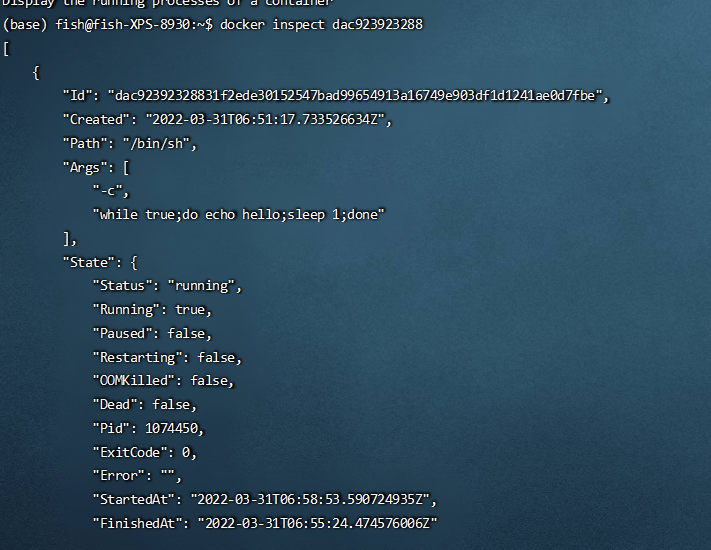

<!--
 * @Author: Bai Xu
 * @Date: 2022-03-31 10:32:59
 * @LastEditTime: 2022-03-31 20:49:04
 * @LastEditors: Please set LastEditors
 * @Description: 打开koroFileHeader查看配置 进行设置: https://github.com/OBKoro1/koro1FileHeader/wiki/%E9%85%8D%E7%BD%AE
 * @FilePath: \docker学习\常用命令.md
-->
# 视频教程地址
> https://www.bilibili.com/video/BV1og4y1q7M4
# 安装及设置源
略
# 帮助文档
> https://docs.docker.com/engine/reference/commandline/docker/
# 博客地址（来源网络）
> https://blog.csdn.net/huangjhai/article/details/118854733
## 镜像命令
镜像是一种轻量级、可执行的独立软件包，用来打包软件运行环境和基于运行环境开发的软件，
它包含运行某个软件所需要的所有内容，包括代码，
运行时（一个程序在运行或者在被执行的依赖）、库，环境变量和配置文件。
```shell
docker images [OPTIONS] [REPOSITORY[:TAG]]
docker search 搜索镜像 
    --filter=STARS=2000
docker pull 下载镜像
```
<!-- > eg. docker pull mysql:latest == docker pull io/library/mysql:latest -->

会分层下载(可以公用不同层)

```shell
docker rmi -f 删除所有的镜像 
docker rmi -f ${docker image -aq} # 会一个一个递归删除所有的image
```

## 容器命令
有了镜像才可以运行容器
```shell
    docker pull centos
```
查看命令帮助: docker run --help
```bash
docker run [OPTIONS] IMAGE [COMMAND] [ARG...]
参数说明：
    --name="NAME" 容器名字
    -d 后台方式运行 nohup
    -it 使用交互方式运行
    -p 指定容器端口 8080:8080
        -p 主机端口:容器端口
        -p 容器端口
        -p ip:主机端口:容器端口
    -P 随机指定端口 
```
新建容器并启动
    
    docker run -it centos  /bin/bash
    退出镜像：exit（会停止容器）
列出所有运行中的容器
    docker ps ：现在运行的
    -a :包含曾经运行过的+现在运行的
    -n=? :最近创建的n个容器
    -q : 只显示id
退出容器
    exit：容器停止并退出
    ctrl + p + q: 容器不停止退出
删除容器
    docker rm [OPTIONS] CONTAINER [CONTAINER...]
    docker rm 容器id # 不能删除运行的容器
    docker rm -f $(docker ps -aq) # 删除所有容器，强制
    # 等价
    docker ps -q -a | xargs docker rm -f 
启动和停止容器
    docker start 容器id
    docker restart 容器id
    docker stop 容器id # 停止在运行的容器
    docker kill # 强制停止
# 常用其它命令
后台启动容器
    docker run -d ImageId
    但是centos会停止。这是因为：**docker容器使用后台运行，就必须有一个前台进程**
    docker发现没有应用，就会自动停止
查看日志
    docker logs [OPTIONS] CONTAINER
    docker run -d centos /bin/sh -c "while true;do echo hello;sleep 1;done"
    
    
查看容器中进程信息
    docker top CONTAINER [ps OPTIONS]
查看镜像元数据（重要）
    docker inspect [OPTIONS] NAME|ID [NAME|ID...]
    
进入当前正在运行的容器
    因为通常我们的容器都是使用后台方式来运行的，有时需要进入容器修改配置
    方式一：进入容器开启一个新的终端，可以在里面操作
    docker exec [OPTIONS] CONTAINER COMMAND [ARG...]
    eg. docker exec -it dac923923288 /bin/bash
    方式二：进入容器正在执行的终端，不会启动新的进程
    docker attach [OPTIONS] CONTAINER 
    # Attach local standard input, output, and error streams to a running container
    docker attach  dac923923288
    进入的是正运行的命令，而不是新开一个命令行 
    
从容器内拷贝文件到主机
    docker cp [OPTIONS] CONTAINER:SRC_PATH DEST_PATH|-
    docker cp [OPTIONS] SRC_PATH|- CONTAINER:DEST_PATH
    把容器内/home/test.java文件拷贝到宿主机
    
    无需容器正在运行
    
    拷贝是一个手动过程，未来使用-v挂载数据卷可以实现自动同步
# commit镜像
docker commit 提交容器称为一个新的副本
docker commit -m "提交的描述信息" -a="作者" 容器id 目标镜像名:[tag]
使用方法：
     docker run -it -p 8080:8080 tomcat  /bin/bash
     发现容器内部没有默认的页面，我想要自己定制
     exit
     
# 容器数据卷
    docker将应用和环境打包成一个镜像。但是数据不应该在容器里。
    数据应该可以持久化，docker容器产生的数据，同步到本地
    方式一：使用命令来挂载-v
    docker run -it -v /path/to/host/folder:/path/to/image/folder /bin/bash
    如果host没有folder，会自动创建
    具名挂载与匿名挂载与指定路径挂载
    匿名挂载：
        -v 容器内路径，省略主机路径。没有写主机路径
    具名挂载
        -v pathname:/root/...。只指定名字，没有指定路径
        docker volume ls可以查看所有卷
        所有docker容器内的卷，没有指定目录情况下都是在host的/var/lib/docker/volumes/xxx
    补充：改变容器内文件权限readonly|readwrite
    docker ..... -v ...:...:[ro|rw]
# Dockerfile
通过dockerfile生成镜像
``
FROM centos

VOLUMNE ["volume01", "volume02"]
CMD echo "-----end----"
CMD /bin/bash
``
    docker build [OPTIONS] PATH | URL | -

    eg. docker build -f Dockerfile -t bx/centos .
    docker images
    
    可以看到volume01，volume02挂载到容器根目录下，这个卷一定与外部有一个同步的卷目录，可以使用docker inpect 容器id找到mount查看匿名挂载路径
步骤：
    1. 编写Dockerfile
    2. docker build构建成为一个镜像
    3. docker run
    4. docker push发布
dockerfile指令都必须大写，从上到下，#表示注释，每一个指令都是一个镜像
指令介绍：
    FROM：基础镜像
    MAINTAINER：作者，负责维护的作者信息+邮箱
    RUN：构建时运行的命令
    ADD：添加内容
    WORKDIR：镜像的工作目录
    VOLUME：设置卷。挂载主机目录
    EXPOSE：指定暴露的端口（-p）
    RUN：运行的命令
    CMD：指定容器启动时候要运行的命令，只有最后一个会生效，可被替代
    ENTRYPOINT：指定容器启动时候要运行的命令，可以追加命令
        比如CMD ls -a，docker run -l会替换到整个命令
        ENTRYPOINT会追加成ls -a -l
    ONBUILD：当构建一个被继承的Dockerfile时，就会运行本指令
    COPY：复制，类似ADD拷贝到镜像中
    ENV：构建的时候设置环境变量
# 重点：CMD与ENTRYPOINT的区别
    vim dockerfile-cmd-test
    FROM centos
    CMD ["ls", "-a"]
    docker run c1dc21c5240b
    
    用cmd的情况下，-l会替换原命令，-l不是命令所以会报错
    
    vim dockerfile-entrypoint-test
    FROM centos
    ENTRYPOINT ["ls", "-a"]
    


# 数据卷容器
    利用一个容器卷去给别的容器共享数据
    docker images 查找bx/centos
    docker run -it --name docker01 bx/centos 
        ctrl + p + q 到后台
    docker run -it --name docker02 --volumes-from docker01 bx/centos
        在docker02中也有/volumes01和/volumes02，而且是同步的关系
    可以继续叠加。。。
    把docker01删除，docker02，docker03，...数据依然在（是一个双向拷贝的概念），
    数据声明持续到没有容器使用位置。